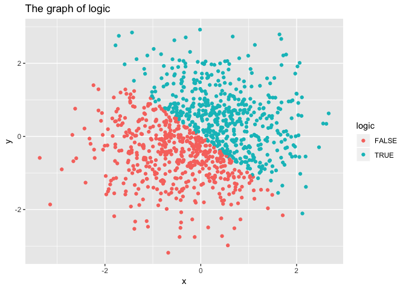
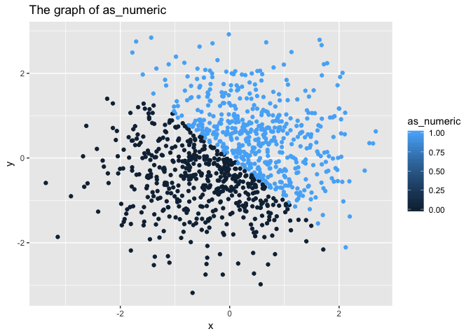
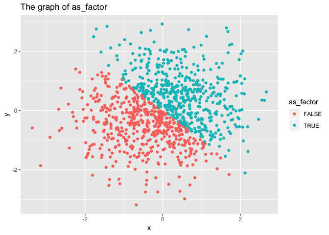

p8105\_hw1\_xy2404.Rmd
================
Annie Yu
9/20/2018

Problem 1
---------

Create data frame with 1.numeric 2. logic 3. character and 4. factor vectors

``` r
Homework1_df = tibble(
  vec_numeric = runif(10, min =, max =5),
  vec_logic = (vec_numeric>2),
  vec_char = c("This", "is", "the", "first", "homework", "for", "the", "data", "Science", "class"), 
  vec_factor = factor(c("T", "F", "T", "T", "T", "F", "T", "T", "T", "T"))
)
```

##### The mean of the variable containing absolute values is

``` r
mean(Homework1_df$vec_numeric)
```

    ## [1] 2.738738

``` r
mean(Homework1_df$vec_logic)
```

    ## [1] 0.8

``` r
mean(Homework1_df$vec_char)
```

    ## Warning in mean.default(Homework1_df$vec_char): argument is not numeric or
    ## logical: returning NA

    ## [1] NA

``` r
mean(Homework1_df$vec_factor)
```

    ## Warning in mean.default(Homework1_df$vec_factor): argument is not numeric
    ## or logical: returning NA

    ## [1] NA

It can be observed that the mean of numeric and logic variable can be derived, while that of character and factor variable failed. It is obvious that numeric vector have mean. The reason that logic variable have mean is that the value was stored as 0 (FALSE) and 1 (TRUE). However, as the character and factor variable are consist of strings, R can not convert them into string, hence NA was then returned.

##### In some cases, you can explicitly convert variables from one type to another. Write a code chunk that applies the as.numeric function to the logical, character, and factor variables (please show this chunk but not the output). What happens? In a second code chunk, convert your character variable from character to factor to numeric; similarly, convert your factor variable from factor to character to numeric. What happens?

``` r
as.numeric(Homework1_df$vec_logic)
as.numeric(Homework1_df$vec_char)
as.numeric(Homework1_df$vec_factor)
```

By converting logical, character, and factor variables into numeric variables. It can be observed that: 1. For the logic variable, True becomes 1 and False becomes 0. 2. For the factor variable, two different elements are randomly assigned to 1 and further integers. 3. For the character variable, NAs are introduced by coercion.

``` r
as.numeric(as.factor(Homework1_df$vec_char))
```

    ##  [1] 9 6 8 3 5 4 8 2 7 1

``` r
as.numeric(as.character(Homework1_df$vec_factor))
```

    ## Warning: NAs introduced by coercion

    ##  [1] NA NA NA NA NA NA NA NA NA NA

After converting character variables into factor variable, it is able to be converted into numeric variables subsequently. However, a factor variable, (which can be converted into numeric variables), can no longer be converted in to numeric after convert into character variable, instead NAs introduced by coercion.

Problem 2
---------

Create a data frame comprised of x and y

``` r
set.seed(1000)

Homework1_Q2_df = tibble(
  x = rnorm(1000),
  y = rnorm(1000),
  logic = x+y>0,
  as_numeric = as.numeric(logic),
  as_factor = as.factor(logic)
)
```

##### Write a short description of your vector using inline R code, including: \* the size of the dataset \* the mean and median of x \* the proportion of cases for which the logical vector is TRUE

The vector is consist of 5 variables, each with 1000 observations. The mean of x is -0.0124759 and the median of x is 0.0225207, the proportion of cases for which the logical vector is TRUE is 0.499.

##### Make three scatterplots of y vs x ( logic, numeric and factor variables)

``` r
logic_plot <- ggplot(Homework1_Q2_df, aes(x = x, y = y,  color=logic)) + geom_point() + ggtitle('The graph of logic')
logic_plot
```



``` r
ggplot(Homework1_Q2_df, aes(x = x, y = y, color=as_numeric)) + geom_point() + ggtitle('The graph of as_numeric')
```



``` r
ggplot(Homework1_Q2_df, aes(x = x, y = y, color=as_factor)) + geom_point() + ggtitle('The graph of as_factor')
```



``` r
ggsave(logic_plot, file='The graph of logic.jpg')
```

    ## Saving 7 x 5 in image
